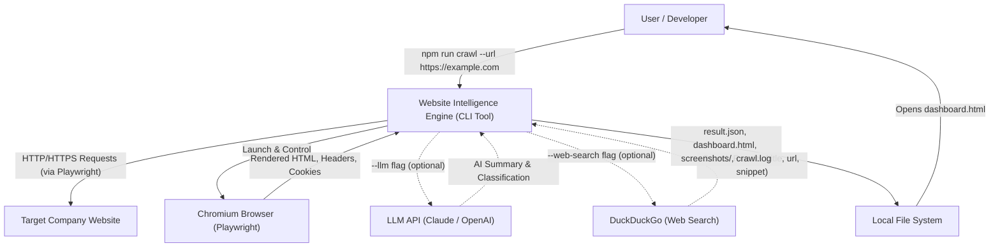
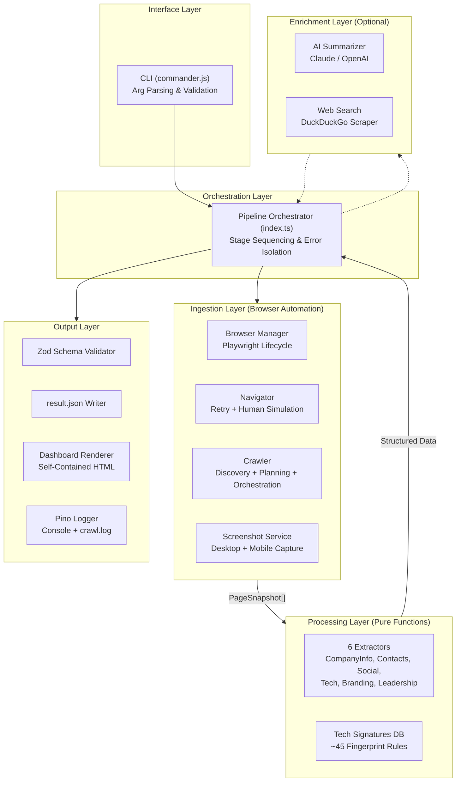
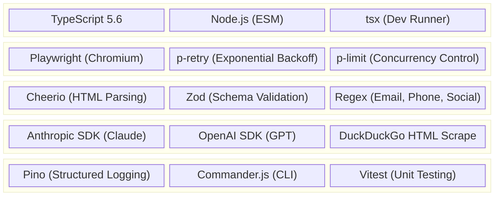
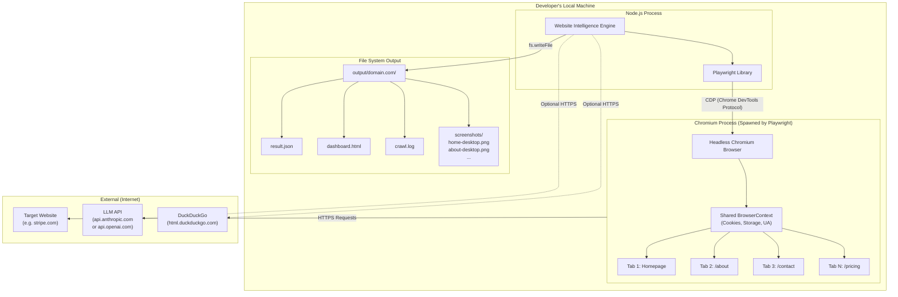
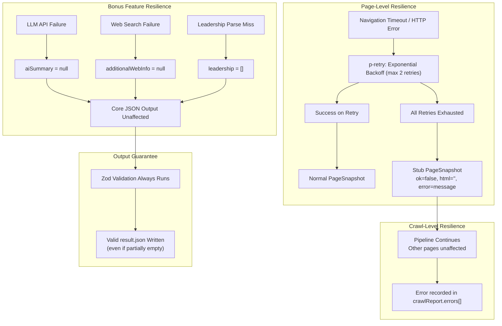

# Website Intelligence Engine — High-Level Design (HLD)

This document provides the **High-Level Design** of the Website Intelligence Engine, covering system context, component architecture, data flow, technology decisions, and deployment topology.

---

## 1. System Context Diagram

Shows the engine as a black box and all external actors and systems it interacts with.

---

## 2. High-Level Component Architecture

The engine is divided into five major subsystems. Each subsystem has a single responsibility and communicates through well-defined data contracts.

---

## 3. End-to-End Data Flow Diagram

Shows how raw data transforms at each stage — from a URL string input to validated JSON output.

```mermaid
flowchart LR
    subgraph INPUT
        URL["Input URL String<br>(e.g. https://stripe.com)"]
    end

    subgraph STAGE_1 ["Stage 1: Browser Ingestion"]
        RENDER["Playwright renders<br>JS-heavy pages"]
        RAW["Raw Artifacts per Page:<br>• HTML string<br>• HTTP headers<br>• Cookie names<br>• Full-page screenshots"]
    end

    subgraph STAGE_2 ["Stage 2: Link Planning"]
        LINKS["Discovered Links<br>(cheerio a[href] parse)"]
        PLAN["Crawl Plan<br>Scored & Deduped<br>max 8 priority pages"]
    end

    subgraph STAGE_3 ["Stage 3: Concurrent Crawl"]
        PAGES["PageSnapshot[]<br>Homepage + up to 8 subpages<br>Each with HTML, headers,<br>cookies, screenshots"]
    end

    subgraph STAGE_4 ["Stage 4: Extraction"]
        FIELDS["Structured Fields:<br>• Company name, desc, industry<br>• Emails, phones, forms<br>• Social links (6 platforms)<br>• Tech stack (~45 sigs)<br>• Logo, favicon<br>• Leadership members"]
    end

    subgraph STAGE_5 ["Stage 5: Enrichment (Optional)"]
        AI_DATA["AI Summary +<br>Industry Classification"]
        WEB_DATA["Web Search Results<br>(title, url, snippet)"]
    end

    subgraph OUTPUT
        FINAL["CompanyProfile<br>(Zod-validated JSON)<br>+ dashboard.html<br>+ screenshots/<br>+ crawl.log"]
    end

    URL --> RENDER --> RAW
    RAW --> LINKS --> PLAN
    PLAN --> PAGES
    PAGES --> FIELDS
    FIELDS --> AI_DATA & WEB_DATA
    AI_DATA & WEB_DATA --> FINAL
    FIELDS --> FINAL
```

---

## 4. Technology Stack Map

---

## 5. Module Dependency Diagram

Shows which source modules import from which, revealing the dependency hierarchy and layer boundaries.

```mermaid
flowchart TD
    cli["cli.ts"] --> index["index.ts"]
    cli --> types["types.ts"]

    index --> crawlOrch["crawler/crawlOrchestrator.ts"]
    index --> companyInfo["extract/companyInfo.ts"]
    index --> contacts["extract/contacts.ts"]
    index --> socialLinks["extract/socialLinks.ts"]
    index --> techDetect["extract/techDetect.ts"]
    index --> branding["extract/branding.ts"]
    index --> leadership["extract/leadership.ts"]
    index --> summarizer["ai/summarizer.ts"]
    index --> webSearch["search/webSearch.ts"]
    index --> dashboard["report/dashboard.ts"]
    index --> logger["report/logger.ts"]
    index --> types

    crawlOrch --> browserMgr["browser/browserManager.ts"]
    crawlOrch --> navigator["browser/navigator.ts"]
    crawlOrch --> linkDisc["crawler/linkDiscovery.ts"]
    crawlOrch --> crawlPlan["crawler/crawlPlanner.ts"]
    crawlOrch --> screenshot["screenshot/screenshotService.ts"]
    crawlOrch --> config["config.ts"]
    crawlOrch --> types

    browserMgr --> config
    navigator --> config
    crawlPlan --> config
    techDetect --> techSigs["data/techSignatures.ts"]

    companyInfo --> jsonLd["extract/jsonLd.ts"]
    leadership --> jsonLd

    linkDisc --> types
    crawlPlan --> types

    style cli fill:#4A90D9,color:#fff
    style index fill:#4A90D9,color:#fff
    style config fill:#F5A623,color:#fff
    style types fill:#F5A623,color:#fff
    style crawlOrch fill:#7B68EE,color:#fff
    style browserMgr fill:#7B68EE,color:#fff
    style navigator fill:#7B68EE,color:#fff
    style linkDisc fill:#7B68EE,color:#fff
    style crawlPlan fill:#7B68EE,color:#fff
    style screenshot fill:#7B68EE,color:#fff
    style companyInfo fill:#50C878,color:#fff
    style contacts fill:#50C878,color:#fff
    style socialLinks fill:#50C878,color:#fff
    style techDetect fill:#50C878,color:#fff
    style branding fill:#50C878,color:#fff
    style leadership fill:#50C878,color:#fff
    style jsonLd fill:#50C878,color:#fff
    style techSigs fill:#50C878,color:#fff
    style summarizer fill:#E74C3C,color:#fff
    style webSearch fill:#E74C3C,color:#fff
    style dashboard fill:#95A5A6,color:#fff
    style logger fill:#95A5A6,color:#fff
```

> **Legend:**
> 🔵 Blue = Orchestration &nbsp;|&nbsp; 🟠 Orange = Shared Config/Types &nbsp;|&nbsp; 🟣 Purple = Ingestion Layer &nbsp;|&nbsp; 🟢 Green = Extraction Layer &nbsp;|&nbsp; 🔴 Red = Optional Enrichment &nbsp;|&nbsp; ⚪ Grey = Output/Reporting

---

## 6. Deployment & Runtime Topology

The engine runs entirely on a single local machine with no server, database, or cloud infrastructure required.

---

## 7. Error Handling & Resilience Strategy (High Level)

Shows how errors propagate and are contained at each layer boundary.

---

## 8. Key HLD Design Principles

| Principle | How It's Applied |
| :--- | :--- |
| **Separation of Concerns** | Browser automation (ingestion), data extraction (processing), and output generation (reporting) are in separate module directories with no cross-dependencies. |
| **Fail-Safe by Default** | Every optional feature and every page visit degrades to `null` / `[]` / stub on failure — the pipeline never crashes from a single page error or a missing API key. |
| **Pure Function Extraction** | All `extract/*` modules are pure functions taking `PageSnapshot[]` and returning data, with zero side effects — enabling deterministic, sub-second unit testing. |
| **Minimal External Dependencies** | Custom tech fingerprints instead of Wappalyzer, DuckDuckGo scrape instead of paid search API, optional LLM — the core engine needs only Playwright and Cheerio. |
| **Single-Machine, Zero-Config Deployment** | No server, no database, no Docker — just `npm install` and `npm run crawl`. Output is self-contained files openable in any browser. |
| **Contract-Driven Output** | The `CompanyProfileSchema` (Zod) acts as the single source of truth for the output shape, validated at runtime before writing to disk. |
