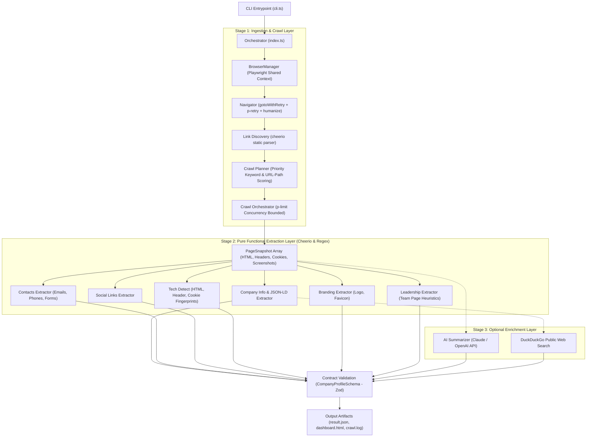
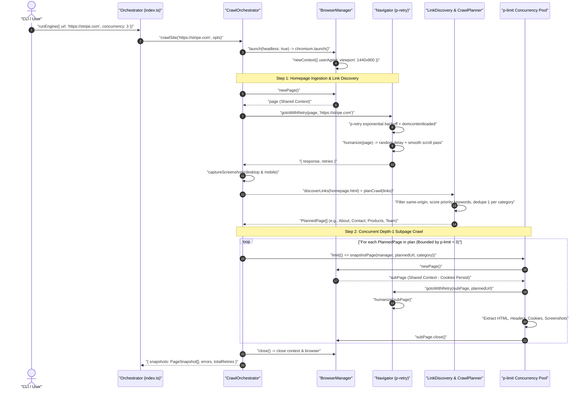
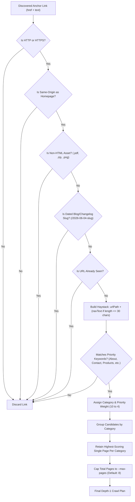
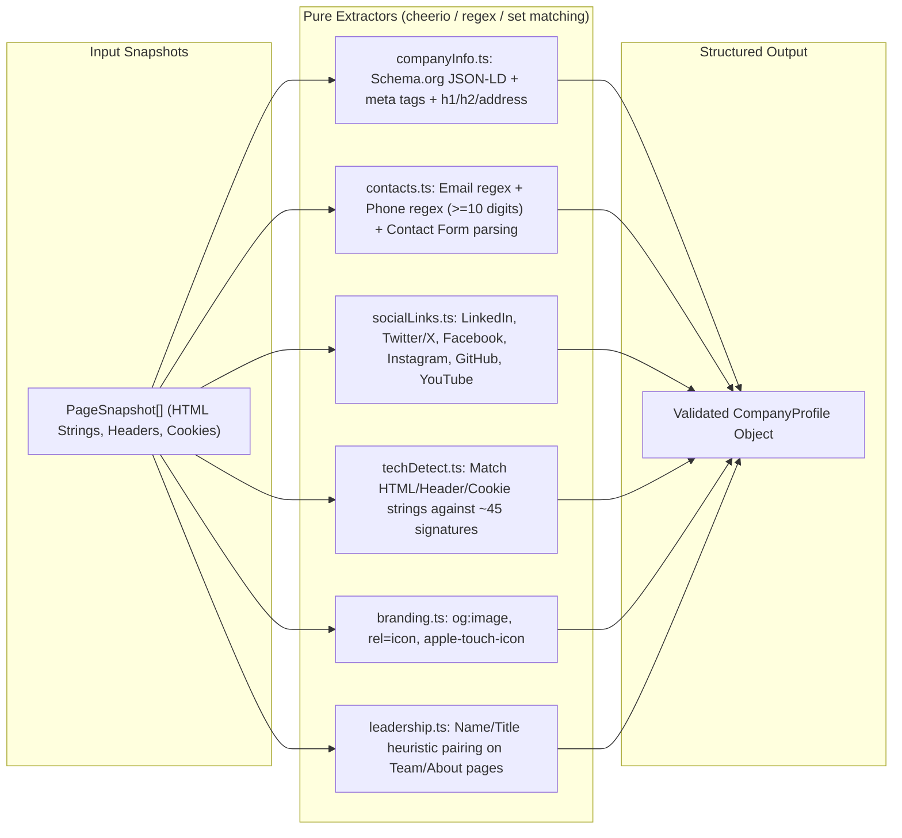
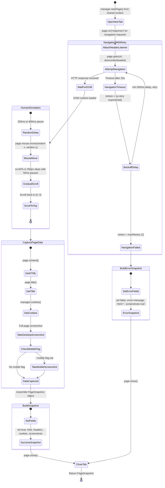

# Website Intelligence Engine — Low-Level Design (LLD) & Architecture Diagrams

This document provides complete visual diagrams (in Mermaid.js syntax) and architectural design documentation for the **Website Intelligence Engine**.

---

## 1. High-Level System Architecture & Pipeline Flow

The engine operates as a multi-stage, decoupled data pipeline. Browser automation is isolated to the ingestion stage, producing pure `PageSnapshot` objects that are consumed by the functional extraction layer.

---

## 2. Concurrency & Browser Lifecycle Sequence Diagram

This sequence diagram illustrates how the `CrawlOrchestrator` manages browser sessions, executes the homepage crawl, builds the depth-1 crawl plan, and visits subpages concurrently using `p-limit`.

---

## 3. Crawl Planning & Priority Scoring Decision Tree

The `CrawlPlanner` guarantees high precision by filtering out false positives (e.g., customer stories mentioning "product" or blog permalinks mentioning "team") before scoring candidate links against priority categories.

---

## 4. Pure Functional Extraction Layer Details

Once snapshots (`PageSnapshot[]`) are collected, the extraction layer operates completely in-memory without browser dependencies, enabling fast and deterministic unit testing.

---

## 5. Engine Pipeline State Diagram

This state diagram shows every major state the engine transitions through during a run, including error recovery paths and optional bonus stages.

```mermaid
stateDiagram-v2
    [*] --> Idle

    Idle --> ParseCLIArgs : User runs CLI command
    ParseCLIArgs --> ResolveURL : Args valid
    ParseCLIArgs --> [*] : Invalid args / --help

    ResolveURL --> InitOutputDir : URL parsed & domain extracted
    InitOutputDir --> LaunchBrowser : mkdir output/domain/

    state BrowserCrawl {
        LaunchBrowser --> HomepageNavigation : chromium.launch() + newContext()

        state HomepageNavigation {
            [*] --> Navigating
            Navigating --> RetryWithBackoff : Navigation timeout / error
            RetryWithBackoff --> Navigating : Retry attempt (max 2)
            RetryWithBackoff --> PageFailed : All retries exhausted
            Navigating --> HumanizePass : domcontentloaded fired
            HumanizePass --> HomepageLoaded : Random delay + scroll + mouse move
            PageFailed --> HomepageLoaded : Return stub snapshot (ok=false)
        }

        HomepageLoaded --> DiscoverLinks : Parse a[href] from rendered HTML (cheerio)
        DiscoverLinks --> PlanCrawl : Filter same-origin, score keywords

        state PlanCrawl {
            [*] --> FilterLinks
            FilterLinks --> ScoreLinks : Remove non-HTTP, cross-origin, assets, dated slugs
            ScoreLinks --> DedupeByCategory : Match against PRIORITY_PAGES keywords
            DedupeByCategory --> CapPages : Keep highest-scoring 1 per category
            CapPages --> PlanReady : Limit to --max-pages
        }

        PlanReady --> ConcurrentSubpageCrawl : PlannedPage[] built

        state ConcurrentSubpageCrawl {
            [*] --> WaitingInPool
            WaitingInPool --> VisitingPage : p-limit slot available
            VisitingPage --> PageRetry : Navigation failure
            PageRetry --> VisitingPage : Retry attempt
            PageRetry --> PageErrored : All retries exhausted
            VisitingPage --> CapturingSnapshot : domcontentloaded + humanize done
            CapturingSnapshot --> ScreenshottingPage : Capture HTML, headers, cookies
            ScreenshottingPage --> PageComplete : desktop + optional mobile screenshot
            PageErrored --> PageComplete : Return stub snapshot (ok=false)
            PageComplete --> WaitingInPool : More pages remaining
            PageComplete --> AllPagesVisited : Last page done
        }

        AllPagesVisited --> CloseBrowser : context.close() + browser.close()
    }

    CloseBrowser --> Extraction : PageSnapshot[] collected

    state Extraction {
        [*] --> RunExtractors
        RunExtractors --> ExtractCompanyInfo
        RunExtractors --> ExtractContacts
        RunExtractors --> ExtractSocialLinks
        RunExtractors --> DetectTechnologies
        RunExtractors --> ExtractBranding
        RunExtractors --> ExtractLeadership
        ExtractCompanyInfo --> ExtractorsDone
        ExtractContacts --> ExtractorsDone
        ExtractSocialLinks --> ExtractorsDone
        DetectTechnologies --> ExtractorsDone
        ExtractBranding --> ExtractorsDone
        ExtractLeadership --> ExtractorsDone
    }

    ExtractorsDone --> CheckLLMFlag

    state BonusEnrichment {
        CheckLLMFlag --> AISummarization : --llm flag set & API key present
        CheckLLMFlag --> CheckWebSearchFlag : --llm not set or no key
        AISummarization --> AISuccess : Claude/OpenAI returns summary
        AISummarization --> AIFailed : API error / timeout
        AIFailed --> CheckWebSearchFlag : aiSummary = null (graceful degradation)
        AISuccess --> CheckWebSearchFlag

        CheckWebSearchFlag --> WebSearch : --web-search flag set
        CheckWebSearchFlag --> BonusDone : --web-search not set
        WebSearch --> WebSearchSuccess : DuckDuckGo results parsed
        WebSearch --> WebSearchFailed : Scrape failed / rate limited
        WebSearchFailed --> BonusDone : additionalWebInfo = null
        WebSearchSuccess --> BonusDone
    }

    BonusDone --> ZodValidation : Assemble CompanyProfile object
    ZodValidation --> WriteOutputs : CompanyProfileSchema.parse() passes
    ZodValidation --> ValidationError : Schema mismatch (should not happen)

    state WriteOutputs {
        [*] --> WriteJSON
        WriteJSON --> RenderDashboard : result.json written
        RenderDashboard --> OutputComplete : dashboard.html rendered
    }

    OutputComplete --> [*] : Run complete, return CompanyProfile
    ValidationError --> [*] : Throw error
```

---

## 6. Per-Page Navigation State Diagram

This shows the lifecycle of a single page visit inside `snapshotPage()`, including retry logic, human-like simulation, and failure capture.

---

## 7. Architectural Choices, Reasons, & Tradeoffs

| Component / Layer | Design Choice | Reason / Motivation | Trade-off / Limitation |
| :--- | :--- | :--- | :--- |
| **Extraction Architecture** | **Decoupled DOM Extraction (`PageSnapshot[] -> Data` via Cheerio)** | • **Testability:** Extraction functions can be unit tested against static HTML fixtures in milliseconds (`npm test`) without browser execution. • **Performance:** Cheerio string parsing is 10x–50x faster than Playwright IPC DOM queries. • **Stability:** Isolates data extraction from browser crash risks. | Cannot execute client-side JavaScript *during* extraction (requires the `humanize` scroll and `domcontentloaded` wait to populate the DOM prior to taking the snapshot). |
| **Link Discovery & Planning** | **Heuristic Keyword & URL-Path Scoring vs. LLM Link Selection** | • **Precision & Speed:** Executes in `<5ms` deterministically. • **Bug Prevention:** Restricting link text checking to $\le 30$ chars and excluding dated permalinks prevents blog articles mentioning "product" or "team" from overriding real landing pages (`/products`). | Custom or non-standard URL structures (e.g., `/what-we-build` without standard keywords) require dictionary additions in `src/config.ts`. |
| **Deduplication Strategy** | **One Page Per Priority Category** | • **Bounded Execution:** Prevents crawling 15 variations of `/blog/post-1...15` or 5 identical `/contact-sales` pages, keeping runs fast ($\le 8$ pages total). | May miss secondary pages inside the same category if a company splits content across two URLs (e.g., `/software` and `/hardware`). |
| **Browser Session Management** | **Shared `BrowserContext` (`BrowserManager`) across Concurrent Visits** | • **Session Persistence:** Cookies, consent banners, and WAF tokens obtained on the homepage persist when visiting subpages. • **Resource Efficiency:** Avoids heavy memory/CPU overhead of launching separate browser processes per tab. | Shared cookies mean pages share browser state; one page modifying local storage could affect another (negligible risk for read-only crawling). |
| **Technology Fingerprinting** | **Curated Fingerprint Dictionary (`TECH_SIGNATURES`) vs. Wappalyzer** | • **Zero Dependency Footprint:** Eliminates heavy npm packages and licensing overhead. • **Traceability:** Every detection (e.g., Cloudflare via `__cf_bm` cookie or `cf-ray` header) is exact, transparent, and easy to debug. | Covers ~45 top enterprise technologies instead of Wappalyzer's 3,000+ long-tail plugins; requires manual additions for new tech. |
| **Optional Web Search** | **DuckDuckGo No-JS Scrape (`--web-search`) vs. Paid Search API** | • **Zero Setup Required:** Allows users to test web search enrichment immediately without purchasing API keys (Bing/Serp/Brave). | **Fragility:** Scraping public HTML (`html.duckduckgo.com`) can break if DuckDuckGo changes its DOM layout or applies rate limits. |
| **Error Handling & Resilience** | **Graceful Bonus & Page-Level Degradation** | • **Pipeline Resilience:** If an LLM API key fails, leadership parsing misses, or a page returns `403 Forbidden` (e.g., Cloudflare bot challenge), the engine catches the error, logs a warning, and completes the JSON report with whatever succeeded. | Output fields may degrade to `null` or `[]` rather than halting early to force manual intervention. |
